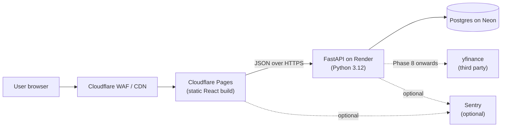

# Architecture

This document describes how the Vega system is wired together end to end. It is the canonical answer to "where does request X go and why". For the per phase delivery plan, see [`plan.md`](plan.md). For the visual reference, see [`design/claude-design-output.html`](design/claude-design-output.html). For the user facing deployment walkthrough, see [`setup-guide.md`](setup-guide.md).

## System diagram



If your renderer does not support mermaid, here is the equivalent ASCII view:

```
                +------------------+
                |  User browser    |
                +--------+---------+
                         |
                         v
                +------------------+
                |  Cloudflare WAF  |
                |   (in front of   |
                |    the frontend) |
                +--------+---------+
                         |
                         v
                +------------------+
                |  Cloudflare      |
                |  Pages           |   (static React build)
                +--------+---------+
                         |
                JSON over HTTPS
                         |
                         v
                +------------------+
                |  FastAPI on      |
                |  Render          |
                |  (Python 3.12)   |
                +----+-------+-----+
                     |       |        ........> Sentry (optional)
                     |       +--------> yfinance (Phase 8+)
                     v
                +------------------+
                |  Postgres on     |
                |  Neon            |
                +------------------+
```

## Components

### User browser
The user opens the deployed URL in any modern browser. There is no native app; the browser is the only client. v1 is unauthenticated, so any visitor can submit calculations and see the shared history (the deferred per user history plan is tracked privately).

### Cloudflare WAF and CDN
Cloudflare sits in front of the static frontend, serving cached assets from the edge and applying its baseline WAF rules (SQL injection, common bot signatures, rate limiting). Introduced in Phase 11 when the frontend is published to Cloudflare Pages; until then, all traffic is local.

### Cloudflare Pages (static React build)
Hosts the production frontend. The site is a React 18 plus Vite plus TypeScript plus Tailwind app, built to static assets at deploy time. Tailwind tokens come from the Oxblood theme exposed in [`design/claude-design-output.html`](design/claude-design-output.html). The frontend talks to the backend exclusively over HTTPS JSON. The frontend scaffold lands in Phase 0 (DevOps Engineer wires the Vite project), the first visible screen ships in Phase 3, heat maps in Phase 4, P&L mode in Phase 5, the Greeks in Phase 7, ticker autocomplete in Phase 8, the model comparison view in Phase 9, the backtest curve in Phase 10, and production deploy happens in Phase 11.

### FastAPI on Render
The backend is a single FastAPI service running on Python 3.12, deployed to Render. It exposes the pricing endpoints (Black Scholes, binomial, Monte Carlo), the heat map endpoint, the persistence endpoints (history list and detail), the yfinance lookup endpoint, and the backtest endpoint. Pydantic models validate every request and response. Structured logging plus request tracing are added in Phase 2 by the Observability Engineer. The pure Python pricing module lands in Phase 1, the FastAPI wrapper in Phase 2, persistence in Phase 6, the Greeks in Phase 7, the yfinance integration in Phase 8, the alternative pricing models in Phase 9, and the backtesting endpoint in Phase 10. Production deploy to Render happens in Phase 11.

### Postgres on Neon
The persistence layer. Neon hosts a managed Postgres instance on a free tier; local development uses SQLite to avoid any cloud setup. SQLAlchemy 2.x is the ORM, Alembic owns migrations. The schema (inputs table, outputs table, calculation_id linking them) lands in Phase 6 along with the first migrations and the persistence wiring. v1 is unauthenticated, so rows are not scoped by user; per user scoping is captured in the maintainer's private notes.

### yfinance (third party)
Used to look up the current price for a ticker symbol so the asset price field can auto fill from a ticker selection. Introduced in Phase 8. The Security Engineer reviews timeouts, response size limits, and retry policy at that point. Historical price ETL for backtests (Phase 10) also pulls through yfinance.

### Sentry (optional)
Error tracking and performance monitoring for both the backend and the frontend. Adopted only if the Observability Engineer recommends it during Phase 2 or later; the project ships fine without it. The DSN is stored as `SENTRY_DSN` in the deploy environment per [`setup-guide.md`](setup-guide.md).

## Data flow: a single Calculate click

1. The user fills the Pricing form and clicks Calculate.
2. The frontend sends a POST to the FastAPI `/price` endpoint with the five inputs as JSON.
3. The backend validates the body via Pydantic, runs the pricing module, and (from Phase 6 onwards) writes one row to the inputs table and N rows to the outputs table inside a single transaction against Neon.
4. The backend returns the call value, put value, Greeks (from Phase 7), and the heat map matrices (from Phase 4) as JSON.
5. The frontend renders the result panel and the heat maps.
6. If the user later opens the History view, the frontend lists prior `calculation_id` rows; clicking one fetches the persisted inputs and outputs and re renders them.

## Authentication

v1 is intentionally unauthenticated. Every visitor sees the same shared history. This is captured as a known v1 limitation in the maintainer's private notes, where a per user history plan (OAuth, `user_id` foreign keys, IDOR review) is documented for a future release.

## Where each component is owned

| Component | Owning agent | Phase introduced |
|---|---|---|
| React frontend | Frontend Developer | Phase 0 scaffold, Phase 3 first screen |
| Tailwind theme tokens | UI/UX Designer | Phase 0 |
| FastAPI service | Backend Developer | Phase 2 |
| Pricing module | Pricing Models Engineer plus Quant Validator | Phase 1, Phase 7, Phase 9, Phase 10 |
| Postgres schema and migrations | Data Engineer plus Database Administrator | Phase 6 |
| yfinance integration | Backend Developer plus Security Engineer | Phase 8 |
| Cloudflare Pages and Render deploys | DevOps Engineer | Phase 11 (with Phase 0 wiring) |
| WAF, HTTPS, CSP, secrets | Security Engineer | Continuous, finalized in Phase 11 |
| Logging, metrics, Sentry | Observability Engineer | Phase 2 |
